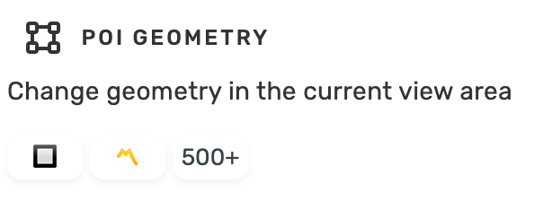
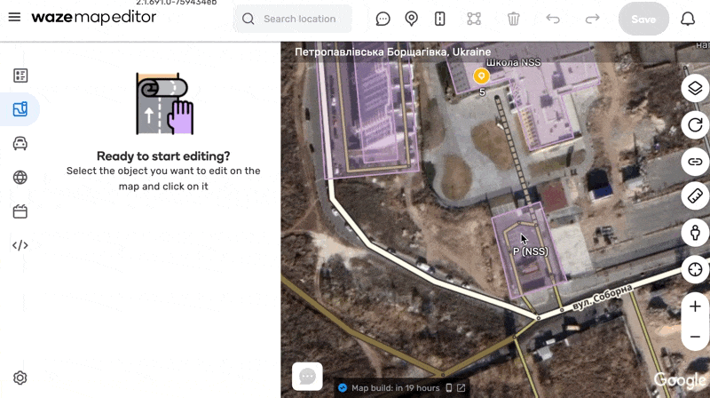

# WME E40
User script for Waze Map Editor.
Create additional panel with buttons for change POI geometry in one click.

## Shortcuts
<table style="width:100%">
<tr>
  <th>Shortcut</th>
  <th>Description</th>
</tr>
<tr>
<td align='center'><code>Shift</code>+<code>1</code></td>
<td>Orthogonalize selected POI(s)</td>
</tr>
<tr>
<td align='center'><code>Shift</code>+<code>2</code></td>
<td>Simplify selected POI(s)</td>
</tr>
<tr>
<td align='center'><code>Shift</code>+<code>3</code></td>
<td>Scale selected POI(s) to 500m²</td>
</tr>
<tr>
<td align='center'><code>Shift</code>+<code>4</code></td>
<td>Scale selected POI(s) to 650m²</td>
</tr>
<tr>
<td align='center'><code>Shift</code>+<code>5</code></td>
<td>Scale selected POI(s) to 650m² if the square lower than 650m²</td>
</tr>
<tr>
<td align='center'><code>Shift</code>+<code>6</code></td>
<td>Copy and paste selected POI(s)</td>
</tr>
</table>

## Links

Author homepage: https://anton.shevchuk.name/  
Author pet projects: https://hohli.com/  
Support author: https://donate.hohli.com/  
Script homepage: https://github.com/AntonShevchuk/wme-e40/  
GreasyFork: https://greasyfork.org/uk/scripts/388271-wme-e40-geometry  
