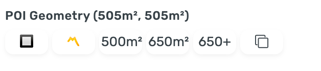
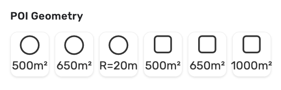
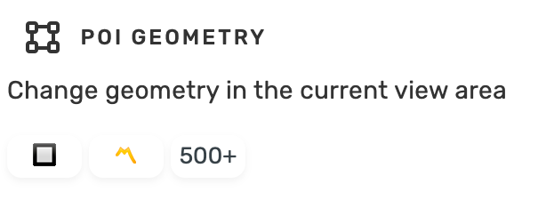
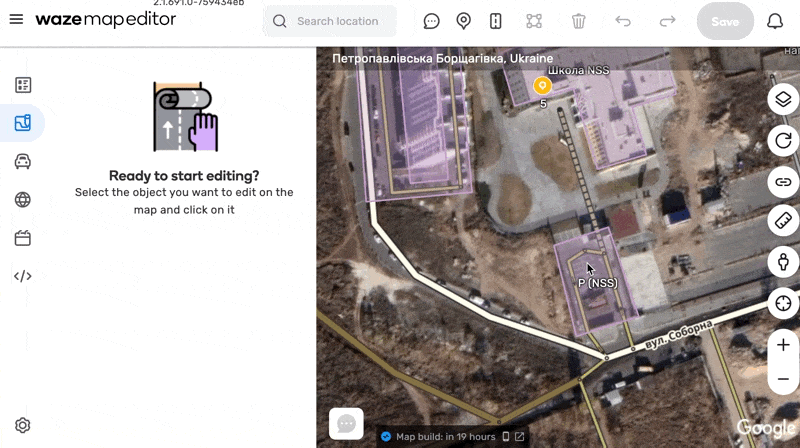

# WME 🇺🇦 E40
User script for Waze Map Editor.
Create additional panel with buttons for change Place geometry in one click.









## Development

### Install & Build

```bash
npm install
npm run build       # one-off build → dist/WME-E40.user.js
npm run watch       # rebuild on changes
```

### Project Structure

Source is written in TypeScript under `src/`, built with Rollup into a single IIFE at `dist/WME-E40.user.js`.

```
src/
├── meta.ts          # userscript header (comment block)
├── style.css        # plain CSS
├── globals.d.ts     # WME runtime globals
├── translations.ts  # i18n (en, uk, ru)
├── types.ts         # road type constants
├── settings.ts      # default settings
├── layers.ts        # navigation vector layer config
├── buttons.ts       # button definitions (place, point, tab)
├── geo-utils.ts     # GeoUtils — spherical geometry math
├── geometry.ts      # polygon creation and manipulation
├── e40.ts           # E40 class (main logic)
├── helpers.ts       # standalone wrapper functions
└── index.ts         # bootstrap entry point
```

### Module Guide

| Module | Responsibility |
|--------|----------------|
| `translations.ts` | `NAME`, `REQUIRED_LEVEL`, `TRANSLATION` (3 languages) |
| `types.ts` | Road type numeric constants (`TYPES.street`, `TYPES.freeway`, etc.) |
| `settings.ts` | Default options (navigation point visibility) |
| `layers.ts` | Layer style rules for navigation vector visualization |
| `buttons.ts` | Three button sets: `getPlaceButtons()` (polygon tools), `getPointButtons()` (point-to-shape), `getTabButtons()` (batch operations for rank 3+) |
| `geo-utils.ts` | `GeoUtils` class — bearing, angle, distance, intersection calculations on the sphere |
| `geometry.ts` | `createCirclePolygon`, `createSquarePolygon`, `simplifyPolygon`, `normalizeRightAngles` |
| `e40.ts` | `E40` class — UI panels, keyboard shortcuts, layer management, all geometry operations |
| `helpers.ts` | Thin wrappers that delegate to the E40 instance (used by button callbacks) |
| `index.ts` | Bootstrap — registers translations/CSS, creates E40 instance on `bootstrap.wme` |

## Shortcuts
<table style="width:100%">
<tr>
  <th>Shortcut</th>
  <th>Description</th>
</tr>
<tr>
    <td align='center'><code>Shift</code>+<code>1</code></td>
    <td>Smooth selected POI(s)</td>
</tr>
<tr>
    <td align='center'><code>Shift</code>+<code>2</code></td>
    <td>Orthogonalize selected POI(s)</td>
</tr>
<tr>
    <td align='center'><code>None</code></td>
    <td>Simplify selected POI(s) (tolerance = 0.00001)</td>
</tr>
<tr>
    <td align='center'><code>None</code></td>
    <td>Simplify selected POI(s) (tolerance = 0.00003)</td>
</tr>
<tr>
    <td align='center'><code>None</code></td>
    <td>Simplify selected POI(s) (tolerance = 0.00005)</td>
</tr>
<tr>
    <td align='center'><code>None</code></td>
    <td>Copy and paste selected POI(s)</td>
</tr>
<tr>
    <td align='center'><code>Shift</code>+<code>3</code></td>
    <td>Enable Rotation for selected Place</td>
</tr>
<tr>
    <td align='center'><code>Shift</code>+<code>4</code></td>
    <td>Enable Scale for selected Place</td>
</tr>
<tr>
    <td align='center'><code>Shift</code>+<code>5</code></td>
    <td>Scale selected POI(s) to 500m²</td>
</tr>
<tr>
    <td align='center'><code>Shift</code>+<code>6</code></td>
    <td>Scale selected POI(s) to 650m²</td>
</tr>
<tr>
    <td align='center'><code>Shift</code>+<code>7</code></td>
    <td>Scale selected POI(s) to 650m² if the square lower than 650m²</td>
</tr>
</table>

## Links

Author homepage: https://anton.shevchuk.name/  
Author pet projects: https://hohli.com/  
Support author: https://donate.hohli.com/  
Script homepage: https://github.com/AntonShevchuk/wme-e40/  
GreasyFork: https://greasyfork.org/uk/scripts/388271-wme-e40-geometry  
